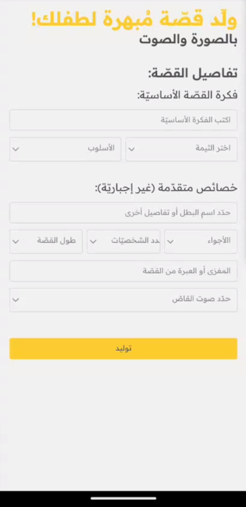
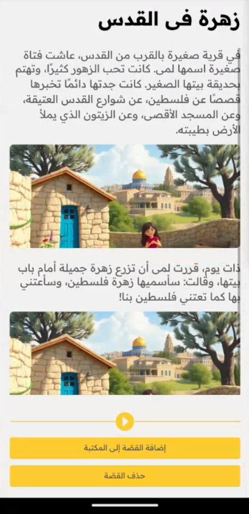
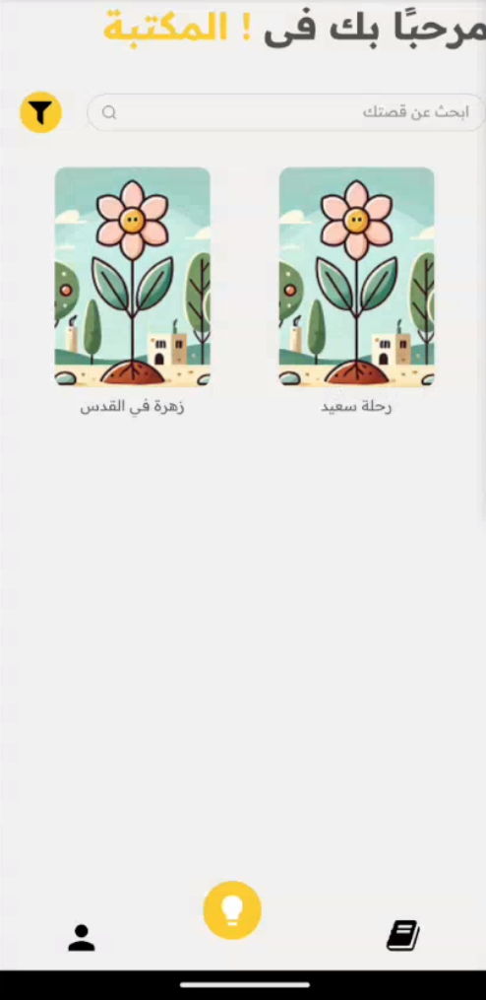
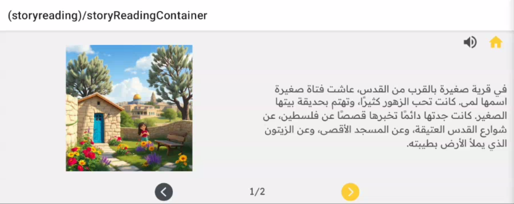

# AI-Powered Arabic Story Generator for Children - القَصَصُ

## Overview:

El-Qassas is a mobile application that enables parents to generate interactive stories for their children, featuring readable text, audio narration, and AI-generated images. Parents can either customize story details or choose from predefined themes, including Arab-Islamic heritage stories and global tales that align with our culture.

The idea of this porject cames from SalamHack Hackathon 2025.

    
    
    

    

   

## Key Features:

- **AI-Generated Stories:** Parents can create customized stories based on themes, morals, or historical events.
- **AI-Generated Illustrations:** Visual elements that enhance the storytelling experience.
- **Audio Narration:** Each generated story includes an audio version for an immersive experience.
- **Personal Library:** Children can save and revisit their favorite stories anytime.
- **Cultural and Educational Themes:** Includes traditional Arab-Islamic heritage stories and values-driven global tales.

## To develop:

- **Interactive content:** where the children can interact with the generated stories and make choices to controll the story's development.

## Technologies used:

- **Frontend:** React-Native, Expo, Gluestack-ui and NativeWind.
- **Backend:** Epressjs and mongoDB.
- **AI API used:** GPT-4o mini and stability.ai.

## Nota Bene:

This solution is intended for arabic-speaking users. Translation are not available for this moment.
